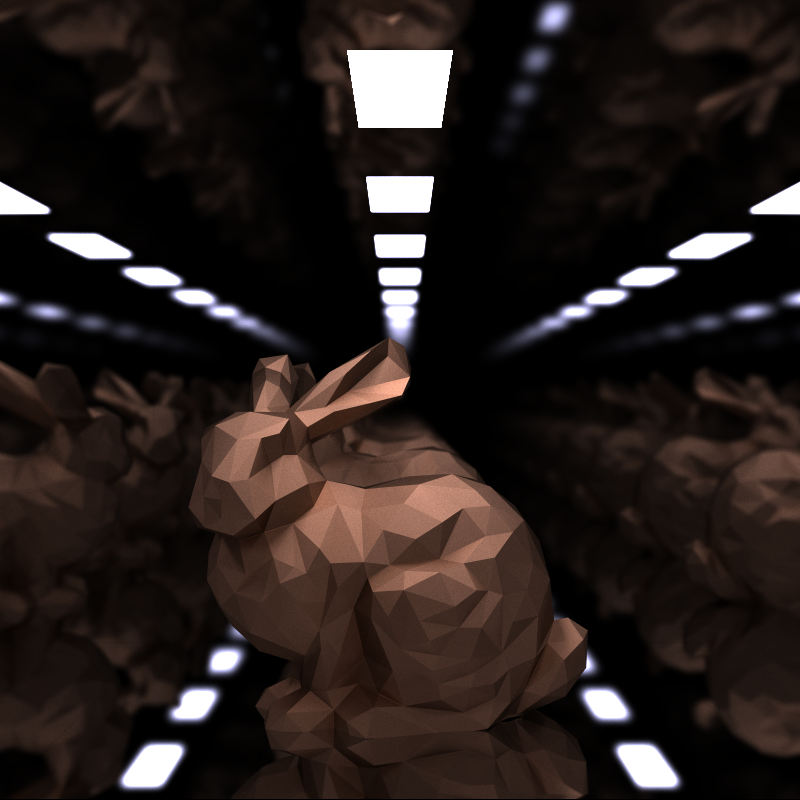
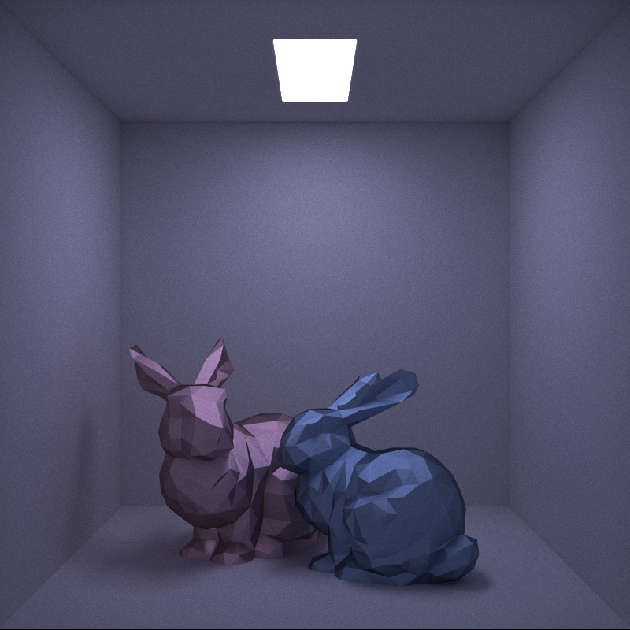
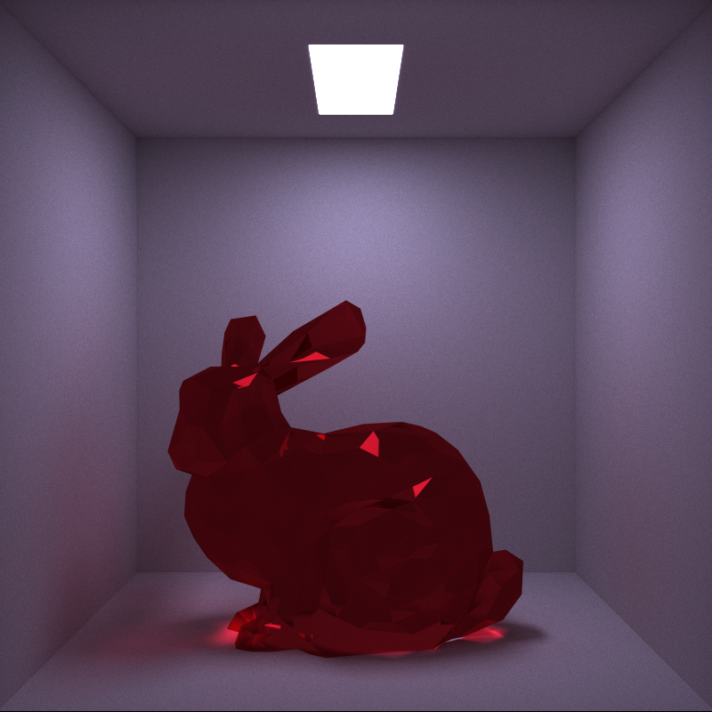

# raygun

Raygun is a compute-shader based path tracer made in OpenGL and Java, using LWJGL. Path tracing is a common technique in computer rendering to create photorealistic images by simulating how light bounces within a scene.

The successor to this project is [raygun-vk](https://www.github.com/alexanderjcs/raygun-vk), which utilizes Vulkan's ray tracing pipeline. The pipeline allows me to utilize hardware acceleration for ray tracing, which enables much faster rendering than the compute shader-based approach used in this project.

## Features

* Compute shader-based path tracing
* Lambertian (diffuse), specular (metal-like), and dielectric (glass-like) materials are supported
* Rendering of spheres and triangles

## Screenshots

